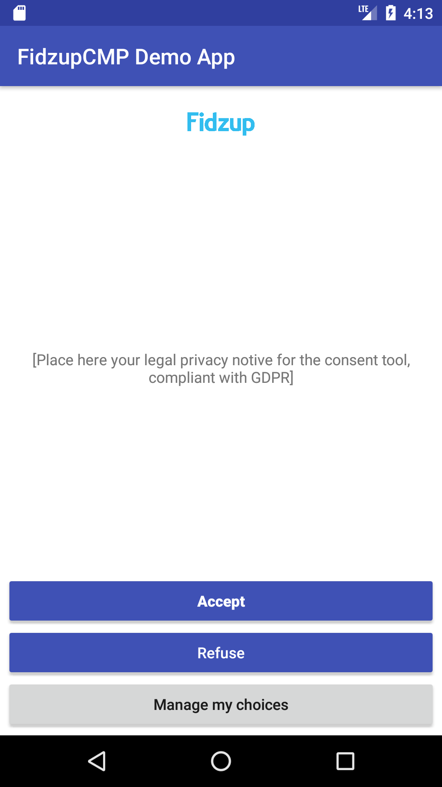
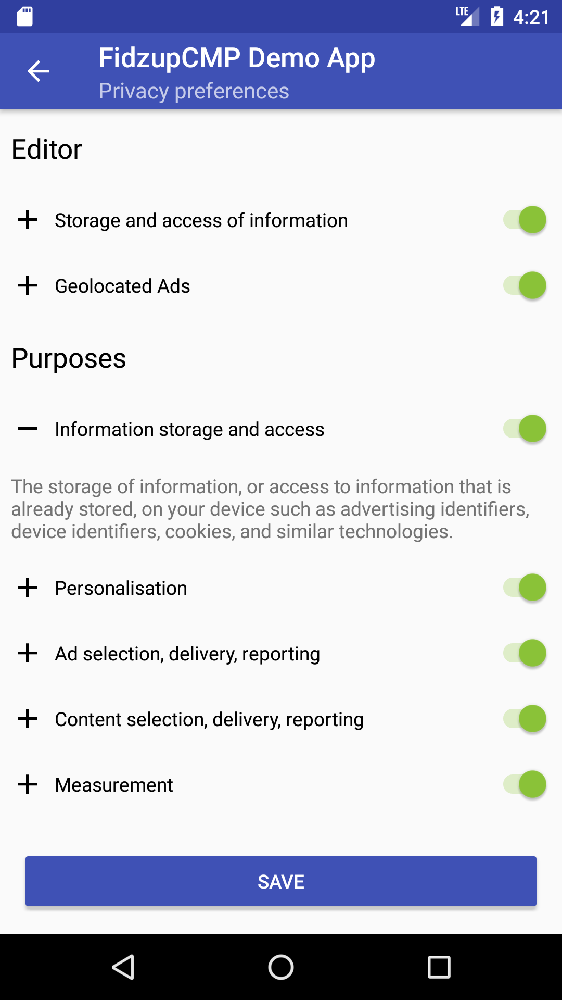
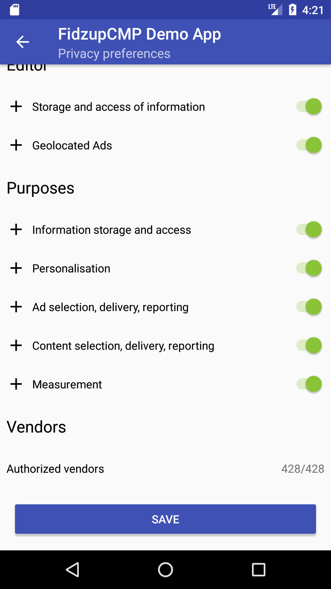
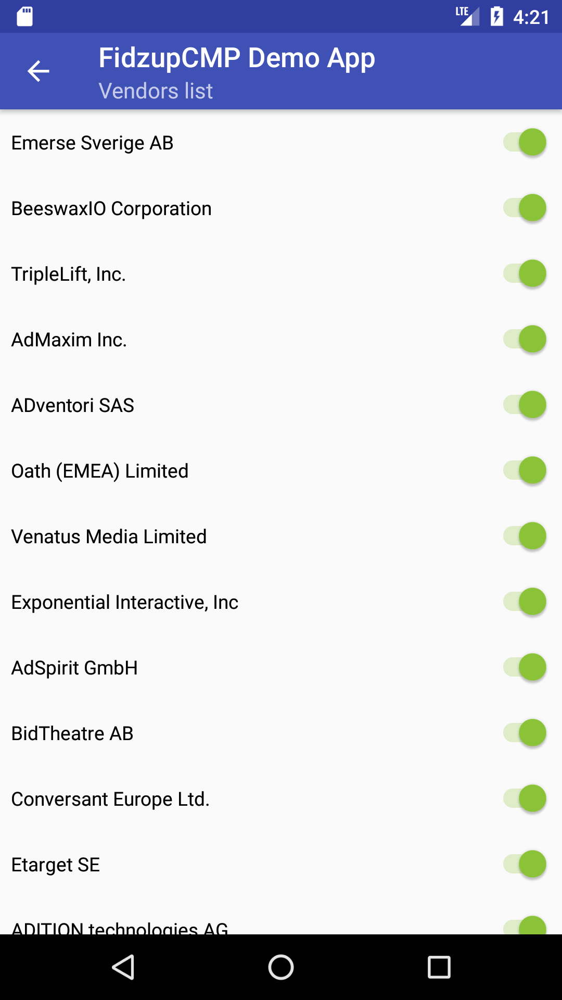

# FidzupCMP for Android

## Introduction

_FidzupCMP for Android_ is an Android SDK (a fork from the [SmartCMP](https://github.com/smartadserver/smart-gdpr-cmp-android)) allowing you to retrieve and store the user's consent for data usage in your Android apps.

The purposes & vendors retrieval as well as the consent storage is compliant with [IAB Transparency and Consent Framework specifications](https://github.com/InteractiveAdvertisingBureau/GDPR-Transparency-and-Consent-Framework).
It also comply with the french regulator on privacy. ([CNIL](https://www.cnil.fr))

Retrieving user consent is mandatory in EU starting May 25th due to the _General Data Protection Regulation (GDPR)_.

<p align="center">
  
  
  
  
</p>

## Usage

### Installation

#### Using Gradle (recommended)

We are working on publishing our artifact on a Maven repo... Until done, please use the git repository directly ;-)

#### From the Git repository

Download this repository then add the `FidzupCMP` module to your project through the _Project Structure_ menu.

### Integration

You must setup the CMP before using it. Start by creating a configuration object that will define how the first screen of the consent tool will look like:
```Java
  ConsentToolConfiguration consentToolConfiguration = new ConsentToolConfiguration(getApplicationContext(),
                R.drawable.logo_smart,
                R.string.cmp_home_screen_text,
                R.string.cmp_home_screen_manage_consent_button_title,
                R.string.cmp_home_screen_close_button_title,
                R.string.cmp_home_screen_close_refuse_button_title,
                R.string.cmp_consent_tool_preferences_appbar_subtitle,
                R.string.cmp_consent_tool_preferences_save_button_title,
                R.string.cmp_consent_tool_preferences_editor_section_header,
                R.string.cmp_consent_tool_preferences_vendors_section_header,
                R.string.cmp_consent_tool_preferences_purposes_section_header,
                R.string.cmp_consent_tool_preferences_vendor_list_access_cell_text,
                R.string.cmp_consent_tool_preferences_allowed_purpose_text,
                R.string.cmp_consent_tool_preferences_disallowed_purpose_text,
                R.string.cmp_purpose_detail_appbar_subtitle,
                R.string.cmp_purpose_detail_allowed_text,
                R.string.cmp_vendors_list_appbar_subtitle,
                R.string.cmp_vendor_detail_appbar_subtitle,
                R.string.cmp_vendor_detail_privacy_policy_button_title,
                R.string.cmp_vendor_detail_purposes_section_header,
                R.string.cmp_vendor_detail_features_section_header,
                R.string.cmp_privacy_policy_appbar_subtitle,
                R.string.cmp_alert_dialog_title,
                R.string.cmp_alert_dialog_description,
                R.string.cmp_alert_dialog_negative_button_title,
                R.string.cmp_alert_dialog_positive_button_title);
```

If you wanna also manage your purposes in the CMP as an editor, you also need to set where to initialize the editor, by giving 2 URLs, or a fixed JSON String. `(If you choose the JSON String configuration, it's not possible to localize it for now)`

You must follow the [JSON Editor file specifications](https://github.com/Fidzup/fidzup-gdpr-editor-json-spec) to be able to use this feature.

Example giving 2 URLs:

```Java
  consentToolConfiguration.setEditorConfiguration(
    "https://www.example.com/well-know-path/editor.json",
    "https://www.example.com/well-know-path/editor-{language}.json");
```

Example giving on JSON String:

```Java
  consentToolConfiguration.setEditorConfiguration(myJsonString);
```

Call the `configure()` method on `ConsentManager.getSharedInstance()` to start the CMP. A good place to configure the _FidzupCMP_ is in the `Application` class of your app, in the `onCreate` method. Indeed, your `Application` instance is needed by the CMP: it will listen to your application entering background or foreground to avoid unnecessary network calls.

```Java
  public class MyApplication extends Application {
    @Override
    public void onCreate() {
      super.onCreate();

      ConsentToolConfiguration consentToolConfiguration = // create your own ConsentToolConfiguration

      // Configure the SmartCMP
      ConsentManager.getSharedInstance().configure(this, language, consentToolConfiguration);
    }
  }
```

When the CMP is started, it will automatically fetch the most recent vendors list _(vendors.json)_ and prompt the user for consent if necessary, saving the resulting consent string in Android _SharedPreferences_ (according to the IAB specifications).

You might want to control when the user will be prompted for consent for better user experience. In this case, define a listener for the ```ConsentManager```:

    ConsentManager.getSharedInstance().setConsentManagerListener(this);

When retrieval of the user consent is required, the `onShowConsentToolRequest(ConsentString consentString, VendorList vendorList)`
 method will be called on the listener and it will be the app's responsability to display the consent tool UI when appropriate.

    @Override
    public void onShowConsentToolRequest(ConsentString consentString, VendorList vendorList) {
        // It is necessary to update the user consent using the consent tool or your own UI
    }

Showing the consent tool is done using the method `showConsentTool()`. Note that this method can be used not only when it has been requested by the consent manager, but also anytime you want to provide a way for the user to change its consent options.

    ConsentManager.getSharedInstance().showConsentTool();

## 'Limited Ad Tracking' behavior

On Android, the user can opt out for any tracking related to advertisement by enabling 'Limited Ad Tracking' in the OS settings. By default, the CMP does not handle this option and let the app developer choose how he wants to proceed if it has been enabled by the user. **Please note that not handling the 'Limited Ad Tracking' option properly is a violation of Google Play Store's terms & conditions. Your app might be removed from the store.**

However, if you configure the CMP with the parameter `showConsentToolWhenLimitedAdTracking` set to _false_, it will handle the 'Limited Ad Tracking' option automatically. In case of limited ad tracking the CMP will not display the consent tool and will not call the delegate, but will instead store a consent string with no consent given for any purposes or vendors.

## Fidzup Adaptations to IAB specifications

To comply with the french regulator ([CNIL](https://www.cnil.fr)), Fidzup has added another purpose not managed by the IAB for now.
Following the TCF Specification the list of [Purposes](https://github.com/InteractiveAdvertisingBureau/GDPR-Transparency-and-Consent-Framework/blob/master/Consent%20string%20and%20vendor%20list%20formats%20v1.1%20Final.md) supported does not include the geolocalized ads. So if you use this CMP, be aware that we add this 6th purpose:

<table>
  <tr>
    <td>purpose number</td>
    <td>purpose name</td>
    <td>purpose description</td>
  </tr>
  <tr>
    <td>6</td>
    <td>Geolocalized Ad</td>
    <td>We use your GPS, wifi or some bluetooth informations to target you and offer you better ads near your favorite shops.</td>
  </tr>
</table>

We also add the management of this 6th purpose to some Vendors.

If you are a vendor, and wanna be listed as a Geolocalized Ad vendor in the CMP, please contact the Fidzup's DPO, who manage the vendor list in a proper way.

If you are an editor, and wanna change some translation, or add some regarding the 6th purpose, please also contact the Fidzup's DPO.

## pubvendor.json Management

If you want to limit the number of vendors in the CMP, you can adopt the _pubvendor.json_ [specification v1.0](https://github.com/InteractiveAdvertisingBureau/GDPR-Transparency-and-Consent-Framework/blob/master/pubvendors.json%20v1.0%20Draft%20for%20Public%20Comment.md).

When this configuration is set, only vendors whitelisted in the pubvendor.json file will be displayed and managed in the CMP.

To enable the management of it just pass a correct URL to the consentToolConfiguration.

example:

```java
consentToolConfiguration.setPubVendorConfiguration("https://www.example.com/well-know-path/pubvendor.json");
```

Be aware that this parameter can only limit the number of vendors declared in the Global Vendor List, by defining a sub list of vendor's id. You can't add a vendor not defined in the Global Vendor List.

## Known limitations

The current version of _FidzupCMP_ has the following limitations:

* The consent tool UI is not customizable (except for static texts). You can however build your own UI and display it in the `consentManagerRequestsToShowConsentTool` listener method using the `vendorList` and the `consentString` parameters.
* _AndroidTV_ apps are not supported.
* No static texts are provided by default (you must provide them to `ConsentToolConfiguration`). The `homeScreenText` should be validated by your legal department.
* _FidzupCMP_ does not have any logic to know if GDPR applies or not based on user's location / age at this time. For the moment it is the publisher's responsibility to determine whether or not GDPR applies and if the consent tool UI should be shown to the user, as well as requesting permission to fetch location or other including / excluding criteria.

## License

### Code source licensing

This software is distributed under the _Creative Commons Legal Code, Attribution 3.0 Unported_ license.

Check the [LICENSE file](LICENSE) for more details.

### Reusing FidzupCMP ID

The CMP ID _'190'_ used for consent string encoding is the CMP ID of _Fidzup_.

You can use this CMP ID as long as you don't alter the source code of _FidzupCMP_. If you do modify the source code, **YOU MUST REGISTER YOUR FORK AS A NEW CMP and change the CMP ID** in `Constants.CMPInfos.ID`. You can register your forked CMP and obtain your own ID here: https://register.consensu.org/CMP
